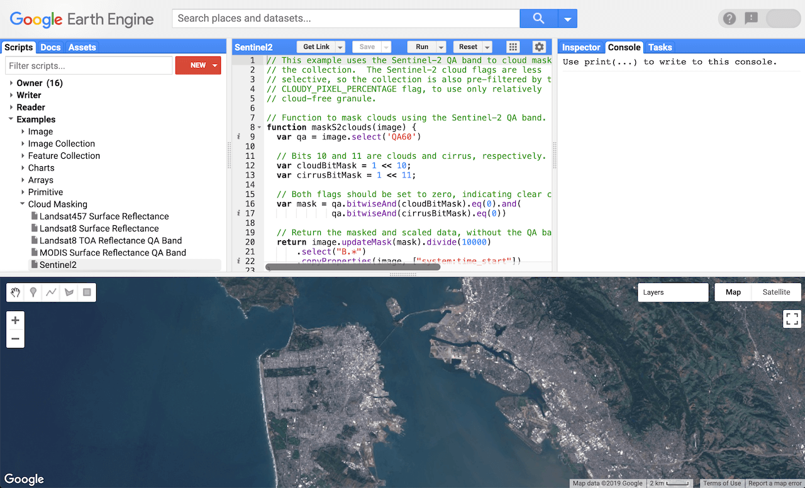
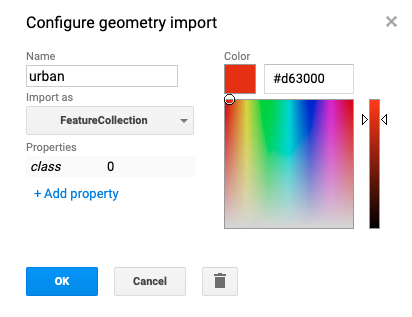
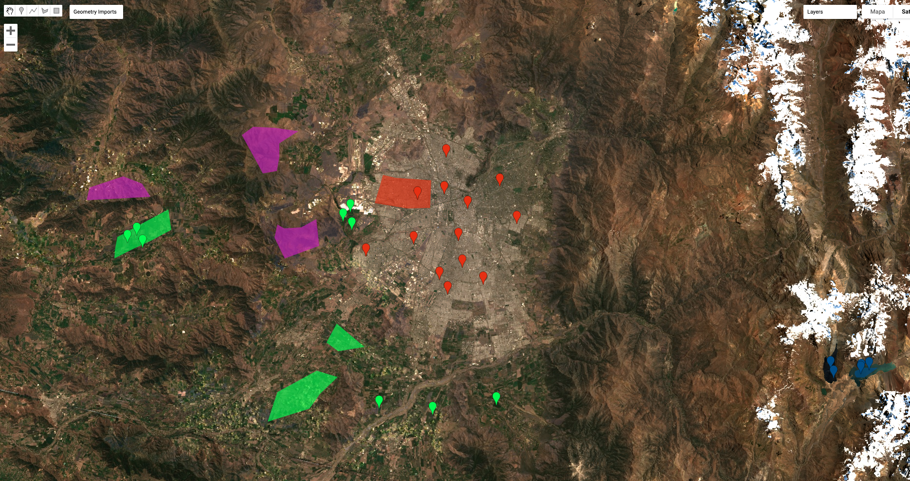
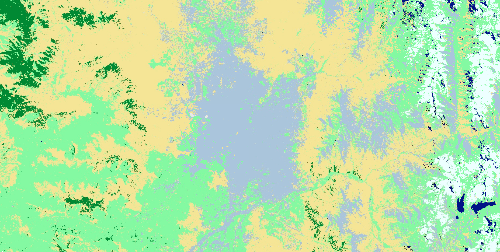
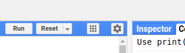
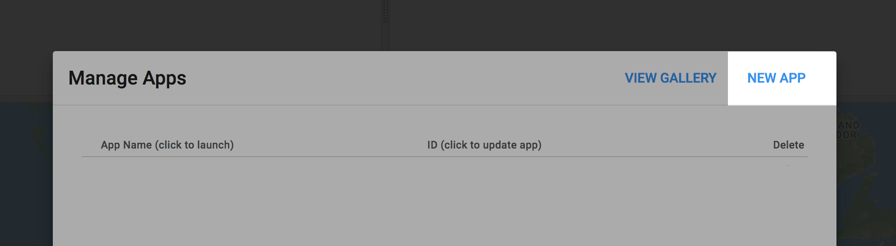
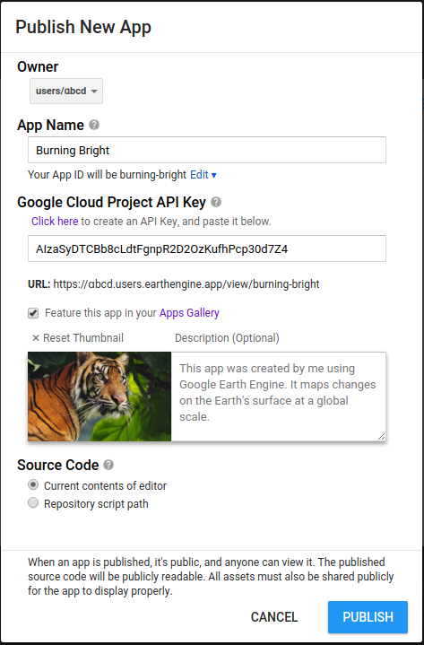

# Google Earth Engine  {.bottom .white data-background="src/images/l8_vilankulos-1080.jpg"}


## ¿Qué es Google Earth Engine (GEE)?

Plataforma de procesamiento geoespacial basado en la nube, de escala global orientada al data análisis ambiental.

</img>

## Componentes Principales

* **Datasets**: A petabyte-scale archive of publicly available remotely sensed imagery and other data.  [Catalogo](https://developers.google.com/earth-engine/datasets/)
* **Compute power**: Google’s computational infrastructure optimized for parallel processing of geospatial data.
* **APIs**: APIs for *JavaScript* and *Python* for making requests to the Earth Engine servers. 
* **Code Editor**: An online Integrated Development Environment (IDE) for rapid prototyping and visualization of complex spatial analyses using the Javascript API. Explore the Code Editor docs.


# INTERFACE GEE  {.left .gray data-background="src/images/tools_laptop.jpg"}

##


</img>
[https://code.earthengine.google.com/](https://code.earthengine.google.com/)


## 

</img>


## {data-background="src/images/solution_earth-1080.jpg"}

Enlaces de Interés (Oficial):

* [Guía General](https://developers.google.com/earth-engine/)
* [Tutoriales](https://developers.google.com/earth-engine/tutorials)
* [Referencia de Funciones](https://developers.google.com/earth-engine/api_docs)
* [Educación](https://developers.google.com/earth-engine/edu)
* [Catalogo](https://developers.google.com/earth-engine/datasets/)
* [Casos de Estudio](https://earthengine.google.com/case_studies/)


# Primeros Pasos {.bottom .gray data-background="src/images/topo_datasets-1080.jpg"}

##

Definición de variables
```{r eval=FALSE}
var variable = 1
var string = 'Hello, World!'
var list = [1.23, 8, -3]
print(list[2])

var dictionary = {
  a: 'Hello',
  b: 10,
  c: 0.1343,
  d: list
}

print(dictionary.b)
print(number, string, list, dictionary)
```


##

Map and Reduce

```{r eval=FALSE}
/* 
ee.List crea objeto de fecha.
se crea una lista para facilitar el mapeo
Mas info sobre funciones ee en la pestaña Docs
*/
var dates = ee.List(["2012-08-14", "2013-08-25", "2014-09-01", "2015-08-23"])

// A function to convert a date to day of year (obtener el día reativo al año)

function DayOfYear(date) {
  return ee.Date(date).getRelative('day', 'year')
}

//  reducir desde del promedio
print(dates) // Lista de fechas
print(dates.map(DayOfYear)) //Lista de números día  año
print(dates.map(DayOfYear).reduce(ee.Reducer.mean())) 
```


# Acceso a Productos Satelitales: DEM {.bottom .white data-background="src/images/res_dem30.jpg" opacity=0.1}

##

[SRTM Digital Elevation Data 30m](https://developers.google.com/earth-engine/datasets/catalog/USGS_SRTMGL1_003)

```{r eval=FALSE}
var image = ee.Image("USGS/SRTMGL1_003")
print(image)
Map.addLayer(image,{min:0, max:2000, palette:["blue", "green", "yellow"]})

var elevation = image.select('elevation');
var slope = ee.Terrain.slope(elevation);
Map.setCenter(-70.6728, -33.4463, 10);
Map.addLayer(slope, {min: 0, max: 100, 
  palette:["#5A606C", "#DEDFE1"]}, 
  'slope');
```

##

</img>


# Acceso a Productos Satelitales: LANDSAT 8 {.bottom .white data-background="src/images/landsat8_RGB_stgo.jpg" opacity=0.5}

##

[USGS Landsat 8 Collection TOA Reflectance](https://developers.google.com/earth-engine/datasets/catalog/LANDSAT_LC08_C01_T1_TOA)

```{r eval =FALSE}
var collection = ee.ImageCollection("LANDSAT/LC08/C01/T1_TOA")
  .filterDate('2019-01-01', '2019-06-01')

Map.setCenter(-70.6728, -33.4463, 10);
  
Map.addLayer(collection,{min:0, max:0.3, //reflectancia 0.3
    bands:["B4", "B3", "B2"]}) //las primeras 3 bandas
```

##

</img>

##

```{r eval =FALSE}
var collection = ee.ImageCollection("LANDSAT/LC08/C01/T1_TOA")
  .filterDate('2019-01-01', '2019-06-01')

Map.addLayer(collection,{min:0, max:0.3,
    bands:["B4", "B3", "B2"]})

Map.setCenter(-70.6728, -33.4463, 10);

var composite = collection.median()
Map.addLayer(composite,{min:0, max:0.3, 
    bands:["B4", "B3", "B2"]}) 
```

##


</img>


# Índices Normalizados NDVI {.center .black data-background="src/images/NDVI_resumen_2018.jpg"}

##


```{r eval = FALSE}
var collection = ee.ImageCollection("LANDSAT/LC08/C01/T1_TOA")
  .filterDate('2019-01-01', '2019-03-01')
Map.setCenter(-70.6728, -33.4463, 10);

var composite = collection.median()

// ndvi = (nir - red) / (nir + red)
var nir = composite.select("B5")
var red = composite.select("B4")

print(nir + red) // Error
// + es sumar dos objetos en proxis (instrucciones) no imagenes en el servidor
```


## 


```{r eval =FALSE}
// ndvi = (nir - red) / (nir + red)
var ndvi = composite.expression("(nir - red) / (nir + red)",{
  nir: composite.select("B5"), // nir y red variables asignada por diccionario
  red: composite.select("B4")
})

Map.addLayer(ndvi,{min:0, max:1, 
  palette:["yellow", "green", "darkgreen"]} ) 
```

</img>

##

```{r eval = FALSE}
// NDVI Mediante Función (mejora performance)
function  addNDVI(image){
  var ndvi = image.expression("(nir - red) / (nir + red)",{
    nir: image.select("B5"),
    red: image.select("B4")
  })
  return ndvi
}
var ndvi = addNDVI(composite)
Map.addLayer(ndvi,{min:0, max:1, palette:["yellow", "green", "darkgreen"]} )
```

</img>

##

```{r eval = FALSE}
// Mapeo de la función en la collection 
var ndviCollection = collection.map(addNDVI)
Map.addLayer(ndviCollection,{min:0, max:1, 
  palette:["yellow", "green", "darkgreen"]} ) 
```

</img>

##
```{r eval = FALSE}
var ndviCollection = collection.map(addNDVI)
// Visulización collection max() (reductores), toma el valor máximo todo el año.
Map.addLayer(ndviCollection.max(),{ //toma los valores maximo de todas las imagenes
  palette:["yellow", "green", "darkgreen"]} )

```

</img>

##

NDVI de año 2018
```{r eval = FALSE}
var result = ee.ImageCollection("LANDSAT/LC08/C01/T1_TOA")
  .filterDate('2018-01-01', '2018-12-31')
  .map(function(image){
      return image.expression("(nir - red) / (nir + red)",{
        nir: image.select("B5"),
        red: image.select("B4")
        })
  })
  .max()

Map.setCenter(-70.6728, -33.4463, 10);
Map.addLayer(result,{palette:["yellow", "green", "darkgreen"]} ) 

```

## {.center .black data-background="src/images/NDVI_resumen_2018.jpg"}


# Índices Normalizados NDWI {.center .white data-background="src/images/NDWV_collect_max.jpg"}

##


```{r eval = FALSE}
var collection = ee.ImageCollection("LANDSAT/LC08/C01/T1_TOA")
  .filterDate('2019-01-01', '2019-03-01')
var composite = collection.median()

// NDWI = (green - nir) / (green + nir)  // Método McFeeters, 1996
var ndwi = composite.expression("(green - nir) / (green + nir)",{
  green: composite.select("B3"),
  nir: composite.select("B5")
})
Map.setCenter(-72.4975, -41.1051, 10);
Map.addLayer(ndwi,{palette:["#25b418", "blue", "black"]} ) 

```


</img>

##


Función NDWI 
```{r eval = FALSE}
var collection = ee.ImageCollection("LANDSAT/LC08/C01/T1_TOA")
  .filterDate('2019-01-01', '2019-03-01')

// NDWI = (green - nir) / (green + nir)  // Método McFeeters, 1996
function  addNDWI(image){
    var ndwi = image.expression("(green - nir) / (green + nir)",{
    green: image.select("B3"),
    nir: image.select("B5")
  })
  return ndwi
}
var ndwiCollection = collection.map(addNDWI)

Map.setCenter(-72.4975, -41.1051, 10);
Map.addLayer(ndwiCollection.max(),{
  palette:["#25b418", "blue", "black"]} ) 
```


## {.center .black data-background="src/images/NDWV_collect_max.jpg"}


# Cloud Masking {.center .grey data-background="src/images/cloud_mask_VALD.jpg"}

##

```{r eval =FALSE}
var collection = ee.ImageCollection("LANDSAT/LC08/C01/T1_TOA")
  .filterDate('2019-01-01', '2019-03-01')
Map.setCenter(-73.0683, -39.8057, 10); //Valdivia

Map.addLayer(collection,{min:0, max:0.3, //reflectancia 0.3
    bands:["B4", "B3", "B2"]}) //las primeras 3 bandas
```

</img>

##

Cloud Masking mediante función
```{r eval = FALSE}
// Function para enmascarar nubes utilizando la Banda Quiality Assurance Landsat 8.
var maskL8 = function(image) {
  var qa = image.select('BQA');
  var mask = qa.bitwiseAnd(1 << 4).eq(0);
  return image.updateMask(mask);
}

var composite = ee.ImageCollection("LANDSAT/LC08/C01/T1_TOA")
  .filterDate('2019-01-01', '2019-06-30')
    .map(maskL8)
    .median();

Map.addLayer(composite, {bands: ['B4', 'B3', 'B2'], max: 0.3});
Map.setCenter(-73.0683, -39.8057, 10); //Valdivia

```

## {.center .black data-background="src/images/cloud_mask_VALD_clean.jpg"}

# Calculos sobre objetos Espaciales

##

Buffer sobre NDVI
```{r eval = FALSE}
var collection = ee.ImageCollection("LANDSAT/LC08/C01/T1_TOA")
  .filterDate('2019-01-01', '2019-03-01')

function  addNDVI(image){
  var ndvi = image.expression("(nir - red) / (nir + red)",{
    nir: image.select("B5"),
    red: image.select("B4")
  }).rename("ndvi")
  return ndvi
}
var ndviCollection = collection.map(addNDVI)
var maxNDVI = ndviCollection.max()

Map.setCenter(-70.6728, -33.4463, 10);
Map.addLayer(maxNDVI,{palette:["yellow", "green", "darkgreen"]} ) 

// Crear un punto y un buffer sobre el
var punto_stgo = ee.Geometry.Point([-70.6673068359375, -33.46577773512672]);
var roi = punto_stgo.buffer(20000)
)
```

## {.center .black data-background="src/images/buffer_stgo.jpg"}


##
Crear Objeto de Vegetación Alta con valor NDVI sobre 0.6
```{r eval = FALSE}
// Vegetación Alta > 0.6 
var thereshold = maxNDVI.gt(0.6) //imagen Binaria (0 y 1)
Map.addLayer(thereshold)
Map.addLayer(roi
             
var area = thereshold.multiply(ee.Image.pixelArea())
    .reduceRegion({
      reducer:ee.Reducer.sum(),
      geometry:roi,
      scale:30, //resolución imagen siempre es en metros
      //maxPixels: xxxxxx+1//1e12, en caso de mensaje de advertencia
      crs: "EPSG:4326"
      
      })
    
print(area)
//B5: 58922585.27239415
print(ee.Number(area.get('ndvi')).divide(1000000))
//58.92258527239415

```
## {.center .white data-background="src/images/ndvi_0.6_buffer.jpg"}


# Clasificación Supervisada {.center .black data-background="src/images/class_sup2.png"}

##
Función para Cloud Masking con QA Band

```{r eval = FALSE}
function maskL8sr(image) {
  // Bits 3 and 5 are cloud shadow and cloud, respectively.
  var cloudShadowBitMask = 1 << 3;  
  var cloudsBitMask = 1 << 5;
  //Get the pixel QA band.
  var qa = image.select('pixel_qa');

  // Both flags should be set to zero, indicating clear conditions.
  var mask = qa.bitwiseAnd(cloudShadowBitMask).eq(0)
      .and(qa.bitwiseAnd(cloudsBitMask).eq(0));

  // Return the masked image, scaled to reflectance, without the QA bands.
  return image.updateMask(mask).divide(10000) // rescale
      .select("B[0-9]*") // NO CONSIDERAR BANDA QUE COMIENCE QA
      .copyProperties(image, ["system:time_start"]);
}
```


##
Definir producto y fecha de estudio
```{r eval =FALSE}
var collection = ee.ImageCollection('LANDSAT/LC08/C01/T1_SR')
    .filterDate('2016-01-01', '2016-12-31')
    .map(maskL8sr)

Map.setCenter(-70.6728, -33.4463, 10);
// Display the results.
Map.addLayer(collection, {min:0, max:0.3, 
  bands: ['B4', 'B3', 'B2']});
```


## {.center .white data-background="src/images/cloud_QA.png"}

##

Reduce por variancia (mejora resultados de clasificación)
```{r eval=FALSE}
var reducer = ee.Reducer.percentile([10,50,90])
  .combine(ee.Reducer.variance(),null, true)

var composite = collection.reduce(reducer);
print(composite)
```


## 

Se puntos o poligonos por cada clase:

</img>

##
</img>


##
Crear Objeto Train y Validación
```{r eval =FALSE}
var points = urban.merge(nubes).merge(water).merge(plantation).merge(forest).merge(hills)
var training = composite.sampleRegions({
    collection: points,
    properties: ["class"],
    scale: 30,
    tileScale:16
}).randomColumn()

var validation = training.filter(ee.Filter.lt('random', 0.1))// bajo a
training = training.filter(ee.Filter.gte('random', 0.1)) // mayor o igual a

print(training.size())
print(training.reduceColumns(ee.Reducer.frequencyHistogram(), ["class"]))
```


##
Clasificador con Random Forest

```{r eval =FALSE}
var classifier = ee.Classifier.randomForest(20).train(training, "class",
composite.bandNames())
print(classifier.confusionMatrix().accuracy())

var result =composite.classify(classifier)
Map.addLayer(result, {min:0, max:5, 
  palette:["#B0C4DE", "#F0FFFF", "#00008B", "#98FB98", "#228B22", "#F0E68C"]})
  //pal   : urbano, nubes, "agua", "plantaciones", "bosques", "cerros")
  //colors css3: https://www.w3schools.com/cssref/css_colors.asp
  
var accuracy = validation.classify(classifier)
  .errorMatrix("class", "classification")
  .accuracy()
  
//print(accuracy)

```

## 
Resultados

</img>


# Exportar Resultados

##

```{r eval= FALSE}

Export.image.toDrive({
  image: maxNDVI,
  description: 'maxNDVI_STGO',
  region: roi,
  scale:30, //resolución imagen
  crs: "EPSG:4326"
})


```

</img>


# Aplicaciones webs {.center .white data-background="src/images/app_gee_2.jpg"}


##

Crear composición y variables de para visualización
```{r eval= FALSE}
var geometry = ee.Geometry.Point([-70.6728, -33.4463]);
var landsat = ee.ImageCollection("LANDSAT/LC08/C01/T1")
    .filterDate('2017-01-01', '2018-01-01')
    .filterBounds(geometry)

//descartar pixeles con nubes
var composite = ee.Algorithms.Landsat.simpleComposite({ 
  collection: landsat,
  asFloat: true
})

var vis = {
  "RGB": {bands: ["B4", "B3", "B2"], min:0, max: 0.3},
  "False Color": {bands: ["B5", "B4", "B3"], min:0, max: [0.5, 0.3, 0.3]},
  "Thermal": {bands: ["B10"], min: 280, max: 310, 
    palette: ["blue", "red", "orange", "yellow"]}
}
```

##

Crear Loop para unir mapas y añadir parámetros de visualización
```{r eval= FALSE}
var maps = [];
for (var label in vis) {
  var map = ui.Map().setControlVisibility(false)
  map.addLayer(composite, vis[label])
  map.add(ui.Label(label))
  maps.push(map);
}

ui.root.widgets().reset(maps)
var linker = ui.Map.Linker(maps);

maps[0].centerObject(geometry, 10)
```
##  {.center .black data-background="src/images/app_gee_1.jpg"}


##





##

</img>


 <!-- Autor: Denis Berroeta Gonzalez CIT-UAI 2019-->